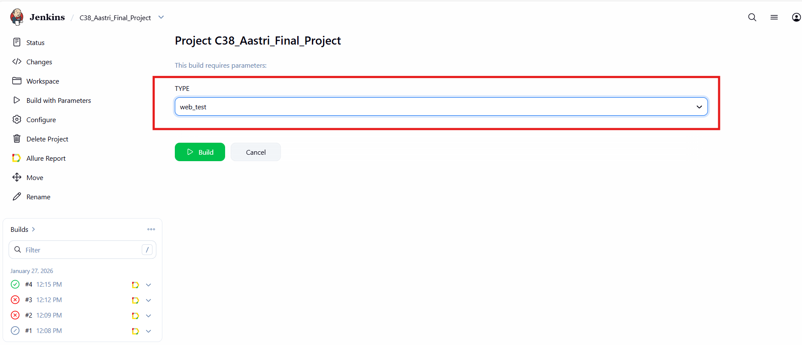

# 🎯 Final Project

<a id="tools"></a>
<div align="center">


</div>

<details>
<summary>Подробное описание используемых в проекте технологий</summary>

> </br>
> 
> | Логотип                                                                                                                            | Название               | Предназначение                                                                                                    |
> | :---:                                                                                                                              | :---:                  | :---                                                                                                              |
> | <a href="https://www.jetbrains.com/idea"></a>  | `Intellij`</br>`IDEA`  | Среда разработки программного обеспечения                                                                         |
> | <a href="https://www.java.com"></a>                             | `Java`                 | Язык программирования, на котором написаны тесты                                                                  |
> | <a href="https://junit.org/junit5"></a>                    | `JUnit 5`              | Фреймворк для модульного тестирования                                                                             |
> | <a href="https://gradle.org"></a>                           | `Gradle`               | Система автоматической сборки                                                                                     |
> | <a href="https://selenide.org"></a>                     | `Selenide`             | Фреймворк для автоматизированного тестирования веб-приложений                                                     |                                                   |
> | <a href="https://www.jenkins.io"></a>                     | `Jenkins`              | Программная система для обеспечения процесса непрерывной интеграции программного обеспечения                      |
> | <a href="https://allurereport.org"></a>              | `Allure`</br>`Report`  | Инструмент для визуализации результатов тестового запуска                                                         |                                                            |
> | <a href="https://telegram.org/"></a>                    | `Telegram`             | Кроссплатформенная система мгновенного обмена сообщениями (мессенджер)                                            |
> | <a href="https://aerokube.com/selenoid"></a>            | `Selenoid`             | Сервер, который позволяет запускать браузеры в docker-контейнерах                                                 |                                            |
> | <a href="https://rest-assured.io/"></a>            | `Rest Assured`             | Технология, разработанная для упрощения тестирования и проверки REST API                                                 |
> | <a href="https://developer.android.com/studio"></a>            | `Android Studio`             | IDE для работы с платформой Android                                                 |
> | <a href="https://appium.io/"></a>            | `Appium`             | Проект с открытым исходным кодом и экосистема связанного с ним программного обеспечения, предназначенная для автоматизации пользовательского интерфейса многих платформ приложений, включая мобильные (iOS, Android, Tizen), браузерные (Chrome, Firefox, Safari) и др.                                                |
> 
> </details>

</br>
</br>

## Содержание:

- [Технологии и инструменты](#tools)
- [Тестовое покрытие](#cases)
- [Локальный запуск тестов](#localrun)
- [Запуск тестов в Jenkins](#remoterun)
- [Allure отчёт](#report)
- [Уведомления в Telegram](#telegram)
- [Видео с примером запуска тестов в Selenoid](#video)

📚 Описание проекта

Фреймворк для автоматизированного тестирования приложения Habitica на всех уровнях: веб-интерфейса через Selenide, REST API через RestAssured и мобильного приложения через Appium. Проект построен на принципах Page Object Model, что обеспечивает чистую архитектуру и легкость поддержки кода.
Тесты выполняются локально, а так же с помощью Jenkins, Selenoid, эмулятора мобильных приложений. Фреймворк интегрирован в CI/CD pipeline через Jenkins и оснащен детальной системой отчетности Allure, которая наглядно отображает результаты выполнения, включая скриншоты и логи каждого шага.
Проект использует современный стек технологий: Java 17 для написания тестов, Gradle для сборки, JUnit 5 в качестве тестового фреймворка и Lombok для сокращения шаблонного кода. Вся конфигурация гибко настраивается через параметры, что позволяет быстро адаптировать тесты под разные окружения и сценарии.

## 🛠 Технологии

Основной стек:


Инструменты тестирования:


Утилиты и библиотеки:


Среды разработки:


CI/CD и управление:


## 🚀 Возможности фреймворка:


🌐 Веб-тестирование

Selenide: Упрощенный и мощный фреймворк для UI тестирования

Selenoid: Запуск тестов в Docker-контейнерах для изоляции и параллельности

Автоматическое управление браузерами

🔁 API-тестирование

REST Assured: Полнофункциональная библиотека для тестирования REST API

Поддержка различных форматов данных (JSON, XML)

Валидация схемы ответов

📱 Мобильное тестирование

Appium: Тестирование Android приложения

Поддержка нативных и гибридных приложений

Интеграция с эмуляторами и реальными устройствами

➕ Дополнительные возможности

Project Lombok: Сокращение boilerplate-кода через аннотации

Allure Report: Детальная визуализация результатов тестирования

Параллельный запуск тестов

Конфигурация через environment variables

<a id="cases"></a>

## 📄 Тестовое покрытие:
### 🌐 Web
🔎 Проверка логина с валидными данными

🔎 Проверка логина без заполненного поля имени

🔎 Проверка логина без заполненного поля пароля

🔎 Проверка логина без заполненных полей имени и пароля

🔎 Проверка добавления задачи 1

🔎 Проверка добавления задачи 2

### 🔁 API
🔎 Проверка логина с получением ID и токена

🔎 Проверка логина с несуществующим пользователем

🔎 Проверка логина с пустым именем

🔎 Проверка логина с пустым паролем

🔎 Проверка создания нового тега

🔎 Проверка создания нового тега и его удаления

### 📱 Mobile (в разработке..)
🔎 Проверка

🔎 Проверка

🔎 Проверка

<a id="localrun"></a>

## Локальный запуск тестов
Для локального запуска WEB тестов из IDE или из терминала необходимо выполнить следующую команду

```
gradle clean web_test
```

Для локального запуска API тестов из IDE или из терминала необходимо выполнить следующую команду

```
gradle clean api_test
```

Для локального запуска Mobile тестов из IDE или из терминала необходимо выполнить следующую команду.
(Необходимо наличие на машине таких тулов как: Appium, Эмулятор мобильного устройства (из Android Studio), UIAutomator tool, установленнные системные переменные для Android)

```
gradle clean mobile_test
```
<a id="remoterun"></a>

## Запуск тестов в [Jenkins](https://jenkins.autotests.cloud/job/%D0%A138_Aastri_Final_Project/)
Для запуска тестов в Jenkins нужно нажать на кнопку Build with parameters и выбрать необходимый скоуп тестов web/api

<p align="center">

</p>

<p align="center">

</p>

<a id="report"></a>

## [Allure отчёт](https://jenkins.autotests.cloud/job/%D0%A138_Aastri_Final_Project/allure/)
### Графики

<p align="center">

</p>

<a id="telegram"></a>
## Уведомления в Telegram

По результатам каждого прогона тестов в Jenkins отправляется сообщение в Telegram. Сообщение содержит информацию о прогоне, а также диаграмму со статистикой прохождения тестов.

<p align="center">

</p>

<a id="video"></a>

## Видео с примером запуска тестов в Selenoid
В Allure отчёте к каждому тесту прикладываются скриншот с последнего шага, и видео прохождения теста. Примеры таких видео:

<p align="center">

</p>

