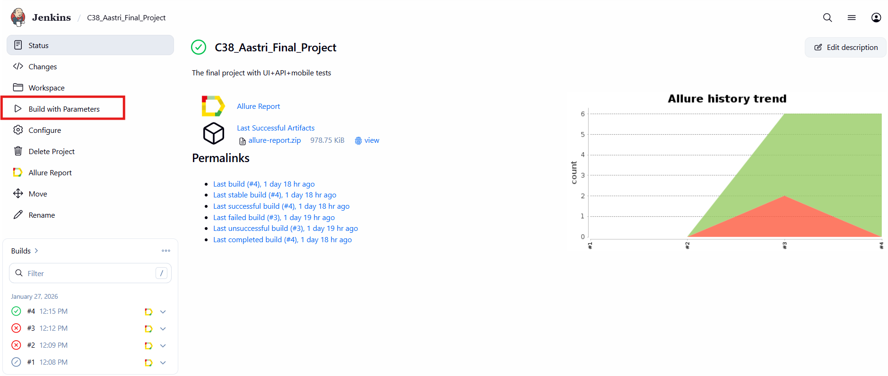
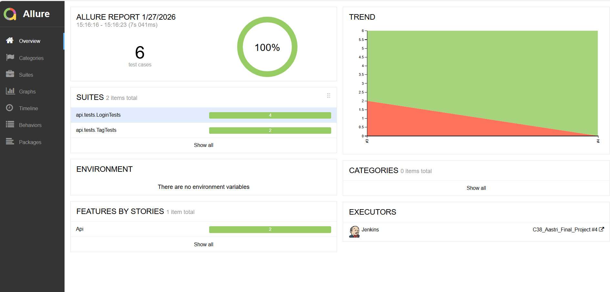
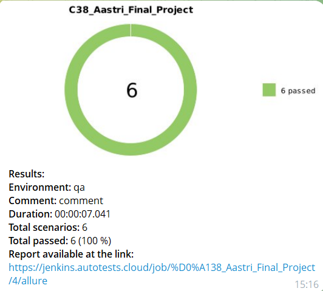

# 🎯 Final Project

<h1>Проект автоматизации тестирования <a target="_blank" href="https://habitica.com/"> Habitica.com </a> </h1>

<p align="center">

</p>

## Summary:

- [Technologies and tools](#tools)
- [Test coverage](#cases)
- [Local run tests](#localrun)
- [Jenkins run tests](#remoterun)
- [Allure report](#report)
- [Telegram notifications](#telegram)
- [Run tests video example from Selenoid](#video)

📚 Project's description

A framework for automated testing of the Habitica application at both the web and API levels: the web interface via Selenide and the REST API via RestAssured. The project is built on Page Object Model principles, ensuring a clean architecture and easy code maintenance.
Tests are run locally, as well as using Jenkins and Selenoid. The framework is integrated into the CI/CD pipeline via Jenkins and features a detailed Allure reporting system that clearly displays execution results, including screenshots and logs for each step.
The project uses a modern technology stack: Java 17 for writing tests, Gradle for building, JUnit 5 as a testing framework, and Lombok for reducing boilerplate code. The entire configuration is flexibly configurable via parameters, allowing you to quickly adapt tests to different environments and scenarios.


## 🛠 Technologies

<a id="tools"></a>
<div align="center">


</div>

<details>
<summary>Detailed description of the technologies used in the project</summary>

> </br>
> 
> | Logo                                                                                                                               | Name                   | Purpose                                                                                                           |
> | :---:                                                                                                                              | :---:                  | :---                                                                                                              |
> | <a href="https://www.jetbrains.com/idea"></a>  | `Intellij`</br>`IDEA`  | Software development environment                                                                         |
> | <a href="https://www.java.com"></a>                             | `Java`                 | The programming language in which the tests are written                                                                  |
> | <a href="https://junit.org/junit5"></a>                    | `JUnit 5`              | Unit testing framework                                                                             |
> | <a href="https://gradle.org"></a>                           | `Gradle`               | Automatic assembly system                                                                                     |
> | <a href="https://selenide.org"></a>                     | `Selenide`             | Framework for automated testing of web applications                                                     |                                                   |
> | <a href="https://www.jenkins.io"></a>                     | `Jenkins`              | software System for ensuring the continuous integration process of software                      |
> | <a href="https://allurereport.org"></a>              | `Allure`</br>`Report`  | Tool for visualizing test run results                                                         |                                                            |
> | <a href="https://telegram.org/"></a>                    | `Telegram`             | Cross-platform instant messaging system (messenger)                                            |
> | <a href="https://aerokube.com/selenoid"></a>            | `Selenoid`             | Server that allows to run browsers in Docker containers                                                 |                                            |
> | <a href="https://rest-assured.io/"></a>            | `Rest Assured`             | Technology designed to simplify testing and validation of REST APIs                                                |
> 
> </details>

</br>
</br>

## 🚀Framework capabilities:


🌐 Web Testing

Selenide: A simplified and powerful framework for UI testing

Selenoid: Run tests in Docker containers for isolation and parallelism

Automatic browser management

🔁 API Testing

REST Assured: A full-featured library for REST API testing

Support for various data formats (JSON, XML)

Response schema validation

➕ Additional Features

Project Lombok: Reduce boilerplate code through annotations

Allure Report: Detailed visualization of test results

Parallel test execution

Configuration via environment variables

<a id="cases"></a>

## 📄 Test Coverage:
### 🌐 Web
◾ Login validation with valid data

◾ Login validation without a populated name field

◾ Login validation without a populated password field

◾ Login validation without populated name and password fields

◾ Task 1 added

◾ Task 2 added

◾ Check Inventory page shown

◾ Check Shops page shown

### 🔁 API
◾ Login validation with ID and token receipt

◾ Login validation with a non-existent user

◾ Login validation with an empty name

◾ Login validation with an empty password

◾ New tag creation validation

◾ New tag creation validation and deletion validation


<a id="localrun"></a>

## Running tests locally
To run WEB tests locally from the IDE or from the terminal, run the following command

```
gradle clean web_test
```

To run API tests locally from the IDE or from the terminal, you need to run the following command

```
gradle clean api_test
```

<a id="remoterun"></a>

## Run tests in [Jenkins](https://jenkins.autotests.cloud/job/%D0%A138_Aastri_Final_Project/)
To run tests in Jenkins, you need to click the Build with parameters button and select the required web/api test scope.

<p align="center">

</p>

<p align="center">

</p>

<a id="report"></a>

## [Allure report](https://jenkins.autotests.cloud/job/%D0%A138_Aastri_Final_Project/allure/)
### Graphics

<p align="center">

</p>

<a id="telegram"></a>
## Telegram notifications

Following each test run, Jenkins sends a message to Telegram. The message contains information about the run and a chart with test statistics.

<p align="center">

</p>

<a id="video"></a>

## Video with an example of running tests in Selenoid
In the Allure report, each test includes a screenshot of the last step and a video of the test being run. Examples of such videos:

<p align="center">

</p>

